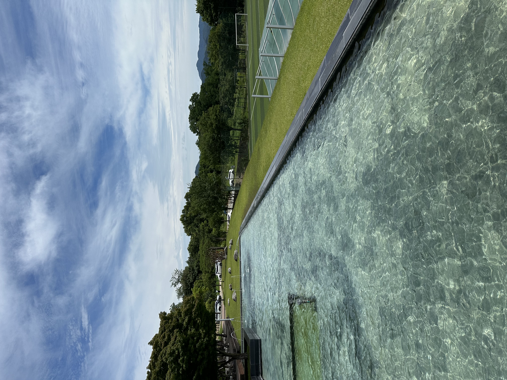
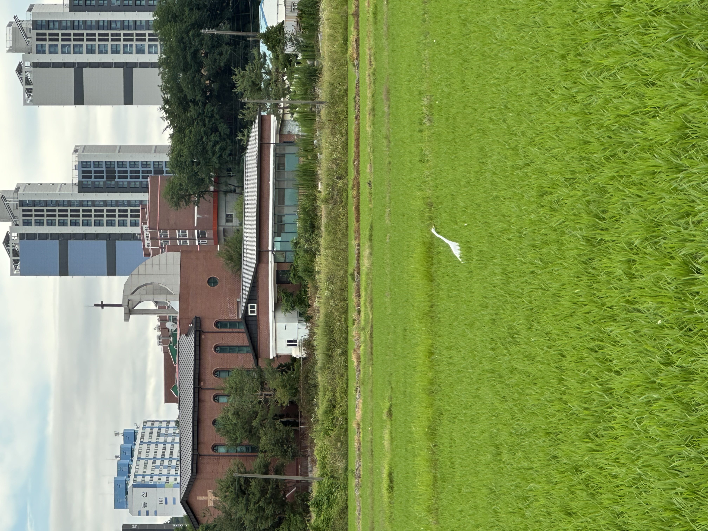
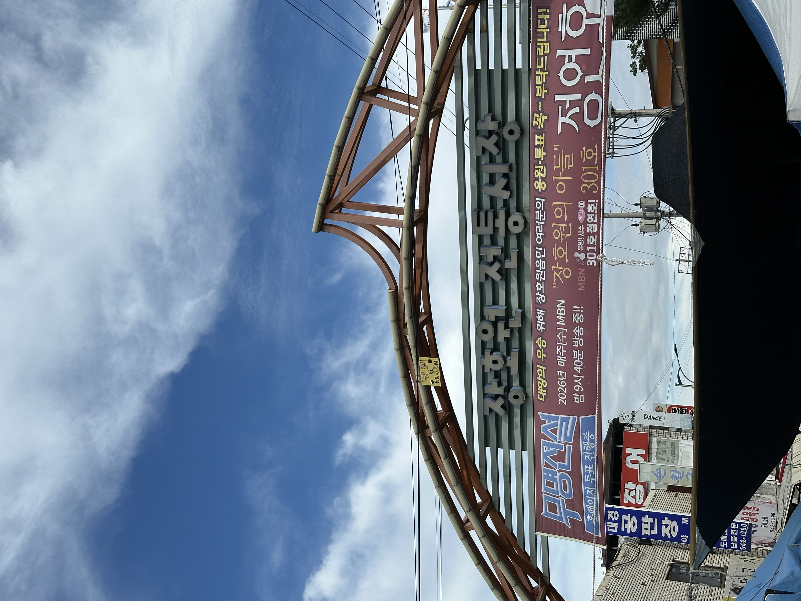
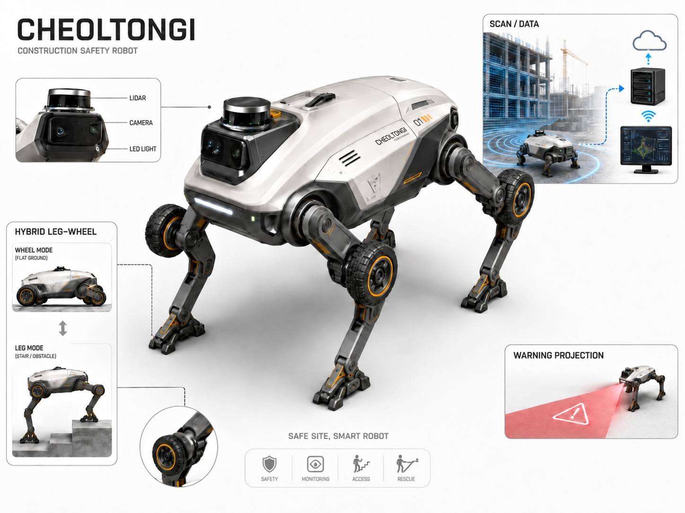
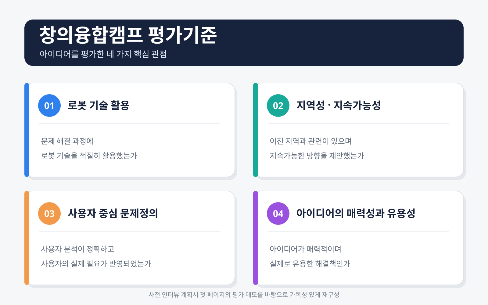

# 2026 지능형 로봇 산업분야 컨소시엄 창의융합캠프

> **Silver Award · 3rd Place**  
> 디자인씽킹을 배우고, 실제 현장조사와 인터뷰를 통해 문제를 재정의한 뒤 지능형 로봇 아이디어를 구체화한 대학연합 창의융합 프로젝트

## Summary

This repository documents my experience at the **2026 Intelligent Robot Consortium Creative Convergence Camp**. Rather than presenting Cheoltongi as a fully developed commercial robot, this portfolio focuses on the process of learning and applying design thinking: preparing interview questions, conducting field research in Janghowon, adapting to unexpected conditions, reframing the problem through interviews and observation, and developing a creative intelligent-robot concept. Our team received the **Silver Award and placed third overall**.

---

## 1. Program Overview

| Item | Details |
|---|---|
| Program | 2026 지능형 로봇 산업분야 컨소시엄 창의융합캠프 |
| Format | 4개 대학 학생으로 구성된 대학연합 팀 프로젝트 |
| Period | 2026.06.24–2026.06.26 |
| Venue | [동원리더스아카데미](https://www.dwleadersacademy.co.kr/), 이천시 장호원읍 |
| Theme | 지능형 로봇을 활용한 이천 지역의 지속가능한 문제 해결 아이디어 제안 |
| Team Result | 은상 · 전체 3위 |
| Final Concept | 철통이 — 건설현장 안전 로봇 시스템 |

<p align="center">
  
</p>
<p align="center"><sub>동원리더스아카데미 — 캠프 진행 장소</sub></p>

### Team

- 광운대학교 이주은
- 단국대학교 이주원
- 숭실대학교 주상현
- 한양대학교 ERICA 이도윤

---

## 2. Portfolio Focus

이 저장소의 목적은 **“철통이라는 로봇을 실제로 완성했다”**고 주장하는 것이 아니다.  
핵심은 다음 역량을 보여주는 것이다.

- 디자인씽킹의 기본 원리를 학습하고 실제 프로젝트에 적용한 경험
- 사전 가설과 인터뷰 계획을 수립한 경험
- 현장에 직접 나가 예상과 다른 상황을 확인하고 대응한 경험
- 인터뷰 답변뿐 아니라 주변 환경을 관찰해 새로운 문제의 단서를 찾은 경험
- 초기 문제에 집착하지 않고 문제를 수정·재정의한 경험
- 관찰과 조사 결과를 페르소나, POV, 아이디어, 시제품 시안으로 구체화한 경험
- 제한된 시간 안에 팀과 협업하여 발표와 Q&A까지 준비한 경험

---

## 3. Design Thinking Journey

```mermaid
flowchart LR
    A[Learn<br/>디자인씽킹 학습] --> B[Plan<br/>사전 인터뷰 계획]
    B --> C[Explore<br/>장호원 현장조사]
    C --> D[Adapt<br/>현장 상황에 따라 조사 변경]
    D --> E[Empathize<br/>주민 인터뷰와 직접 관찰]
    E --> F[Reframe<br/>문제 방향 수정]
    F --> G[Define<br/>페르소나와 POV]
    G --> H[Ideate<br/>철통이 아이디어 도출]
    H --> I[Prototype<br/>제품 시안과 시뮬레이션]
    I --> J[Present<br/>최종 발표와 Q&A]
    J --> K[Award<br/>은상 · 3위]
```



상세 과정은 [`notes/design-thinking-process.md`](notes/design-thinking-process.md)에 정리한다.

---

## 4. Learning Design Thinking

캠프에서는 매력적인 아이디어 자체보다 **사용자의 실제 환경과 필요를 정확히 이해하는 것**이 중요하다는 점을 배웠다.

사전 인터뷰 계획서의 첫 사례는 아이들이 놀이기구를 돌리는 힘으로 물을 끌어올리는 **PlayPump**였다. 겉으로는 창의적이고 지속가능해 보였지만 실제 사용자, 유지관리 환경과 지역 조건을 충분히 반영하지 못해 실패 사례가 되었다. 이 사례는 프로젝트 전반에서 다음 질문을 계속 확인하게 한 기준이었다.

- 우리가 해결하려는 문제가 실제 사용자가 겪는 문제인가?
- 사용자에게 필요한 해결책인가?
- 현장 환경에서도 작동할 수 있는가?
- 매력적인 아이디어를 넘어 실제로 유용한가?

---

## 5. Initial Assumptions and Interview Plan

현장조사 전에는 이천 시민의 생활 불편을 확인하기 위해 다음과 같은 가설을 세웠다.

1. 주차 정산기와 같은 기계 사용에서 불편이 있을 수 있다.
2. 보행 속도 차이와 횡단보도 이용 과정에서 불편이 있을 수 있다.
3. 로봇 기술이 사용자의 이동과 기계 사용을 도울 수 있다.

이를 검증하기 위해 다음 순서의 질문을 준비했다.

- 이천에서 생활하면서 개선되기를 바라는 점
- 불편이 발생한 구체적인 경험과 원인
- 해당 문제가 지금까지 해결되지 않은 이유
- 사용자가 생각하는 해결책
- 제안 서비스의 사용 의향과 개선 의견

이 자료는 실제 인터뷰 결과가 아니라 **현장에 나가기 전 준비한 초기 조사 계획**이다. 실제 현장에서는 계획대로 인터뷰를 수행하지 못했고, 그 차이가 문제를 다시 바라보는 계기가 되었다.

- 원본 자료: [`documents/interview-plan-original.pdf`](documents/interview-plan-original.pdf)
- 상세 정리: [`notes/design-thinking-process.md`](notes/design-thinking-process.md)

---

## 6. Field Research in Janghowon

### 6.1 Encountering the Real Environment

장호원에 도착해 직접 본 환경은 사전 인터뷰 계획에서 상상한 도심형 생활환경과 달랐다. 논과 농지가 넓게 분포한 농촌 지역이었으며, 현장을 직접 확인하면서 초기 가설과 실제 지역 사이에 차이가 있다는 점을 체감했다.

### 6.2 Adapting the Research Plan

처음에는 주민이 많이 모일 것으로 예상한 교회를 방문했지만, 당시 별도 행사로 인해 인터뷰 대상자가 거의 없었다. 현장에 있던 운전기사님과 간단히 대화한 뒤 시장이 열렸다는 정보를 듣고 **장호원 전통시장으로 조사 장소를 변경**했다.

### 6.3 Resident Interviews

시장 인근의 노인 대상 교육시설에서 어르신들을 인터뷰했고 다음과 같은 의견을 들었다.

- 톡버스가 생긴 이후 멀리 이동하는 일반 버스가 부족해졌다는 의견
- 대중교통이 불편하다는 의견
- 지역에서 즐길 수 있는 여가생활이 부족하다는 의견

### 6.4 Direct Observation

인터뷰 답변과 별개로 지역을 이동하며 **외국인 노동자가 많이 보인다는 점**을 관찰했다. 이 관찰은 외국인 노동자의 작업환경과 안전 문제를 추가로 조사하게 된 출발점이 되었다.

> 교통·여가 문제는 주민 인터뷰에서 확인한 내용이고, 외국인 노동자 문제는 팀이 현장에서 별도로 관찰한 내용이다.

<table>
  <tr>
    <td width="50%" align="center"></td>
    <td width="50%" align="center"></td>
  </tr>
  <tr>
    <td align="center"><sub>현장조사 중 확인한 장호원의 농촌 환경</sub></td>
    <td align="center"><sub>조사 장소를 변경해 방문한 장호원 전통시장</sub></td>
  </tr>
</table>

현장조사 상세 기록은 [`notes/field-research.md`](notes/field-research.md)에 정리한다.

---

## 7. Reframing the Problem

초기에는 주차와 보행처럼 일상생활의 불편을 예상했지만, 현장에서는 농촌 지역의 교통 문제와 함께 외국인 노동자의 존재가 눈에 띄었다. 팀은 초기 질문에 억지로 답을 맞추기보다 관찰에서 얻은 새로운 단서를 바탕으로 문제 방향을 수정했다.

```text
초기 예상 문제
주차 정산 · 보행 불편
        ↓
현장 인터뷰
교통 불편 · 장거리 이동 부족 · 여가생활 부족
        ↓
직접 관찰
지역 내 외국인 노동자 다수 확인
        ↓
추가 조사
외국인 건설노동자와 건설현장 안전 문제 탐색
        ↓
문제 재정의
언어 장벽과 변화하는 작업환경 속에서 위험을 직관적으로 알리고 대응할 방법
```

발표자료에서는 이 문제를 구체화하기 위해 이천의 외국인 건설노동자를 중심으로 페르소나와 POV를 구성했다. 실제 인터뷰 인물인지 팀에서 구성한 발표용 페르소나인지는 공개 웹페이지 제작 전 다시 확인하여 표기를 확정한다.

- 상세 정리: [`notes/problem-definition-and-pov.md`](notes/problem-definition-and-pov.md)

---

## 8. Team Concept — Cheoltongi

### 철통이: 건설현장 안전 로봇 시스템

철통이는 현장조사와 문제 재정의의 결과로 제안한 **지능형 로봇 기반 건설안전 콘셉트**다. 실제 산업용 로봇을 제작하거나 구조 안전성을 검증한 결과물이 아니라, 현장에서 발견한 문제를 기술 아이디어로 구체화한 디자인씽킹 프로젝트 결과물이다.

<p align="center">
  
</p>
<p align="center"><sub>Cheoltongi Concept Design — 실제 완제품이 아닌 제안 시스템의 콘셉트 렌더링</sub></p>

주요 아이디어는 다음과 같다.

- 건설현장의 골조와 작업환경을 지속적으로 스캔
- 스캔 데이터를 서버로 전송하고 현장 상태를 누적
- 위험 구역과 작업자 위치를 분석
- 작업자가 언어와 관계없이 인지할 수 있도록 위험 구역을 빛으로 표시
- 추락 가능성을 감지하고 사고 발생 시 대응하는 안전 기능 제안
- 바퀴와 다리를 결합한 이동 구조로 평지·계단·단차 대응

### Concept Status

- **Type:** Design Thinking Project
- **Output:** Concept Design / Interactive Concept Simulation
- **Not:** Commercial Product / Verified Safety Device / Physical Robot Prototype

철통이의 기능과 한계는 [`notes/cheoltongi-concept.md`](notes/cheoltongi-concept.md)에 정리한다.

---

## 9. Existing Technology Research

아이디어를 공상에서 끝내지 않기 위해 발표와 Q&A를 준비하며 다음과 같은 기존 기술을 조사했다.

- 건설현장 순찰과 스캐닝에 활용되는 사족보행 로봇
- LiDAR·Camera·IMU 기반 SLAM과 현장 매핑
- Scan-to-BIM 및 건설 Digital Twin
- 작업자와 위험구역을 감지하는 스마트 건설 안전 플랫폼
- 온보드 컴퓨팅과 중앙 서버의 분산 처리

발표자료에는 Boston Dynamics Spot, Bentley iTwin, 센서 융합, LiDAR 환경 대응, 예상 부품 비용 등이 Q&A 사전자료로 포함되어 있다. 이 자료는 아이디어의 현실성을 검토하기 위한 **Research Appendix**이며, 당시 조사한 가격과 성능 수치를 검증된 최종 사양으로 사용하지 않는다.

- 상세 정리: [`notes/research-and-qa.md`](notes/research-and-qa.md)

---

## 10. Concept Simulation

팀은 철통이의 작동 흐름을 설명하기 위해 Three.js 기반의 인터랙티브 콘셉트 시뮬레이션을 제작했다.

```text
현장 스캔
→ 구조 레이어와 현장 데이터 누적
→ 위험도 분석
→ 현장 프로젝션 경고
→ 작업자 추락 감지
→ 구조 장치 전개
```

시뮬레이션은 실제 제품 성능이나 구조 안전성을 검증한 프로그램이 아니라, 아이디어와 작동 흐름을 전달하기 위한 **Concept Simulation**이다.

- 소스 진입 파일: [`simulation/cheoltongi-fast30/index.html`](simulation/cheoltongi-fast30/index.html)
- 실행 안내: [`simulation/cheoltongi-fast30/README.txt`](simulation/cheoltongi-fast30/README.txt)
- 원본 패키지: [`downloads/cheoltongi-fast30.zip`](downloads/cheoltongi-fast30.zip)
- 로컬 실행: 압축 해제 후 `run_server.bat` 또는 `python -m http.server 8000`

> GitHub 파일 화면은 소스 확인용이다. 실제 시뮬레이션은 ZIP을 내려받아 로컬 브라우저에서 실행한다.

---

## 11. Final Presentation and Award

최종 발표는 다음 순서로 구성했다.

1. 문제정의 및 POV
2. 아이디어 해결책 제시
3. 최종 결과물
4. 제품 소개 및 시제품 시안
5. 질의응답

평가기준은 다음 네 관점으로 정리했다.

- **로봇 기술 활용:** 문제 해결 과정에 로봇 기술을 적절히 활용했는가
- **지역성·지속가능성:** 이천 지역과 관련이 있으며 지속가능한 방향인가
- **사용자 중심 문제정의:** 사용자 분석이 정확하고 실제 필요가 반영되었는가
- **아이디어의 매력성과 유용성:** 매력적이면서 실제로 유용한 해결책인가

<p align="center">
  
</p>
<p align="center"><sub>사전 인터뷰 계획서 첫 페이지의 평가 메모를 바탕으로 가독성 있게 재구성</sub></p>

### Result

> **은상 · 전체 3위**

- 최종 발표자료: [`documents/final-presentation-cheoltongi.pdf`](documents/final-presentation-cheoltongi.pdf)
- 평가기준 시각자료: [`assets/images/evaluation/evaluation-criteria.svg`](assets/images/evaluation/evaluation-criteria.svg)

---

## 12. What This Experience Demonstrates

이 캠프 경험을 통해 보여주고자 하는 역량은 다음과 같다.

- **현장 중심 문제 발견:** 직접 지역을 방문하고 관찰한 경험
- **유연한 조사 수행:** 예상과 달랐던 상황에서 장소와 조사 방식을 변경한 경험
- **사용자 중심 사고:** 준비한 해결책보다 사용자의 경험을 먼저 들으려 한 과정
- **문제 재정의:** 초기 가설을 수정하고 새로운 문제 방향을 도출한 경험
- **창의적 아이디어 구체화:** 관찰을 로봇 시스템 아이디어와 시뮬레이션으로 발전시킨 경험
- **협업과 발표:** 서로 다른 대학의 팀원들과 제한된 시간 안에 결과물을 만든 경험
- **기술 현실성 검토:** 기존 로봇, Digital Twin, 센서와 비용을 조사해 Q&A를 준비한 경험

---

## 13. My Contribution

개인 기여도는 팀 결과물을 과장하지 않도록 실제 담당 업무를 다시 확인한 뒤 구체적으로 작성한다.

현재 정리할 항목:

- 현장조사와 인터뷰 과정에서 담당한 역할
- 문제정의 및 아이디어 제안 과정에서의 기여
- 철통이 기능 기획에서 담당한 부분
- 발표자료·시뮬레이션·Q&A 자료 제작에서 담당한 부분
- 최종 발표에서 담당한 역할

작성 기준은 [`notes/my-contribution.md`](notes/my-contribution.md)에 정리한다.

---

## 14. Visual Materials Plan

최종 포트폴리오 웹페이지에서는 실제 자료와 새로 제작하는 설명 이미지를 함께 사용한다.

### Actual Materials

- 동원리더스아카데미 현장 사진
- 장호원의 넓은 논과 농촌 환경 사진
- 장호원 전통시장 사진
- 실제 인터뷰 계획서와 발표자료
- 철통이 개념 이미지
- 시뮬레이션 소스와 원본 ZIP

### Reconstructed and Future Visuals

- 평가기준 시각자료
- Design Thinking Journey
- Initial Plan vs. Field Reality
- Interview and Observation Flow
- Problem Reframing Diagram
- From Field Insight to Cheoltongi
- Existing Technologies and Concept Integration

실제 사진은 경험의 사실성과 현장성을 보여주고, 재구성·생성 이미지는 사진만으로 설명하기 어려운 사고 과정과 논리 흐름을 시각화한다.

---

## 15. Repository Structure

```text
2026-Intelligent-Robot-Creative-Convergence-Camp/
├─ README.md
├─ UPLOAD_GUIDE.md
├─ documents/
│  ├─ README.md
│  ├─ interview-plan-original.pdf
│  └─ final-presentation-cheoltongi.pdf
├─ simulation/
│  └─ cheoltongi-fast30/
│     ├─ README.md
│     ├─ README.txt
│     ├─ index.html
│     ├─ app.js
│     ├─ style.css
│     └─ run_server.bat
├─ downloads/
│  ├─ README.md
│  └─ cheoltongi-fast30.zip
├─ assets/
│  └─ images/
│     ├─ camp/dongwon-leaders-academy.jpg
│     ├─ field-research/janghowon-rice-field.jpg
│     ├─ field-research/janghowon-traditional-market.jpg
│     ├─ project/cheoltongi-concept-overview.jpg
│     └─ evaluation/evaluation-criteria.svg
└─ notes/
   ├─ design-thinking-process.md
   ├─ field-research.md
   ├─ problem-definition-and-pov.md
   ├─ cheoltongi-concept.md
   ├─ research-and-qa.md
   ├─ my-contribution.md
   └─ reflection-and-limitations.md
```

자료 파일명과 구성 원칙은 [`UPLOAD_GUIDE.md`](UPLOAD_GUIDE.md)에 정리되어 있다.

---

## 16. References

- [캠프 모집 공지 — 숭실대학교](https://scatch.ssu.ac.kr/%ea%b3%b5%ec%a7%80%ec%82%ac%ed%95%ad/?f=all&category&slug=2026-%EB%8C%80%ED%95%99%EC%97%B0%ED%95%A9-%EC%B0%BD%EC%9D%98%EC%9C%A9%ED%95%A9%EC%BA%A0%ED%94%84-%EC%B0%B8%EA%B0%80%ED%95%99%EC%83%9D%EA%B3%B5%ED%95%99%EA%B3%84%EC%97%B4-%EB%AA%A8%EC%A7%91&keyword=erica)
- [캠프 세부 일정](https://sites.google.com/ssu.ac.kr/2026ssu01/%ED%99%88)
- [동원리더스아카데미](https://www.dwleadersacademy.co.kr/)

---

## Notice

본 저장소의 철통이 이미지는 제품 콘셉트 렌더링이며, 시뮬레이션은 아이디어 설명을 위한 시각적 프로토타입이다. 실제 건설현장 적용, 구조 안전성, 인체 보호 성능 또는 상용 제품 성능을 검증한 결과가 아니다.
