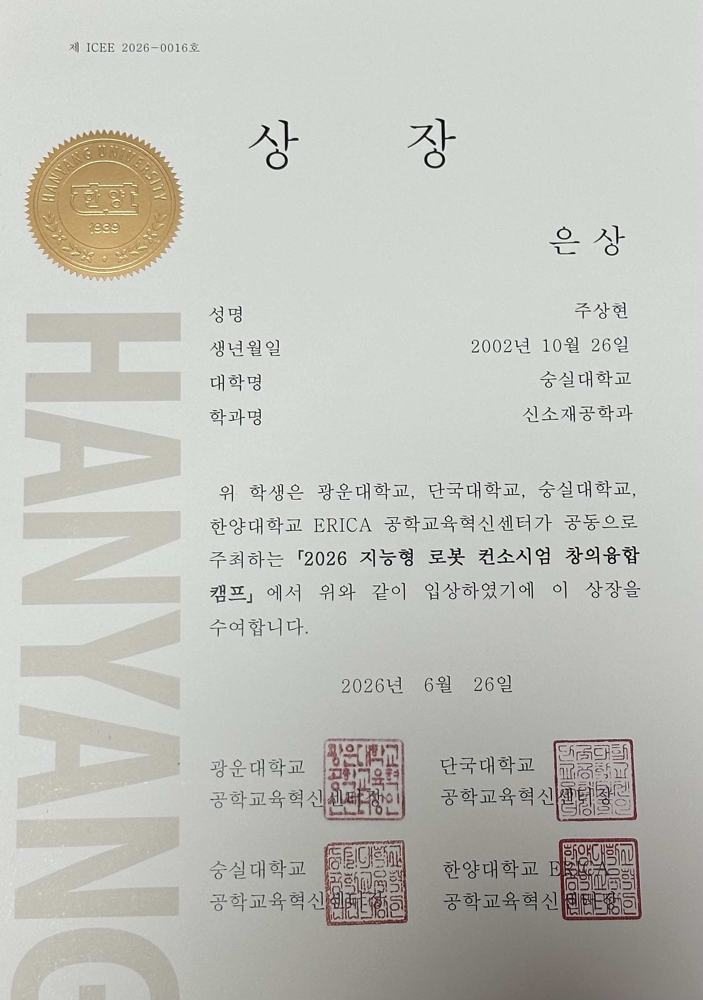

# Evaluation Images

평가기준 원본 메모를 바탕으로 재구성한 시각자료와 실제 수상 증빙 이미지를 보관한다.

## Current Files

### Evaluation Criteria

[`evaluation-criteria.svg`](evaluation-criteria.svg)

- 사전 인터뷰 계획서 첫 페이지의 평가 메모를 바탕으로 제작
- 원본 사진을 그대로 게시하지 않고 네 가지 평가 관점을 가독성 있게 정리
- 원본의 `유영한 아이디어`는 문맥에 따라 `유용한 아이디어`로 바로잡아 표기
- 평가 항목의 의미를 새로 추가하거나 점수 체계를 임의로 만들지 않음

<p align="center">
  
</p>

### Silver Award Certificate

[`silver-award-certificate.jpg`](silver-award-certificate.jpg)

- 2026 지능형 로봇 산업분야 컨소시엄 창의융합캠프 은상 수상 증빙
- 메인 README와 향후 포트폴리오 웹페이지의 `Evaluation and Result` 섹션에서 사용
- 세로형 원본 비율을 유지하며 과도하게 확대하지 않음

<p align="center">
  
</p>

수상 결과는 다음처럼 표기한다.

```text
Silver Award · 3rd Place
은상 · 전체 3위
```
